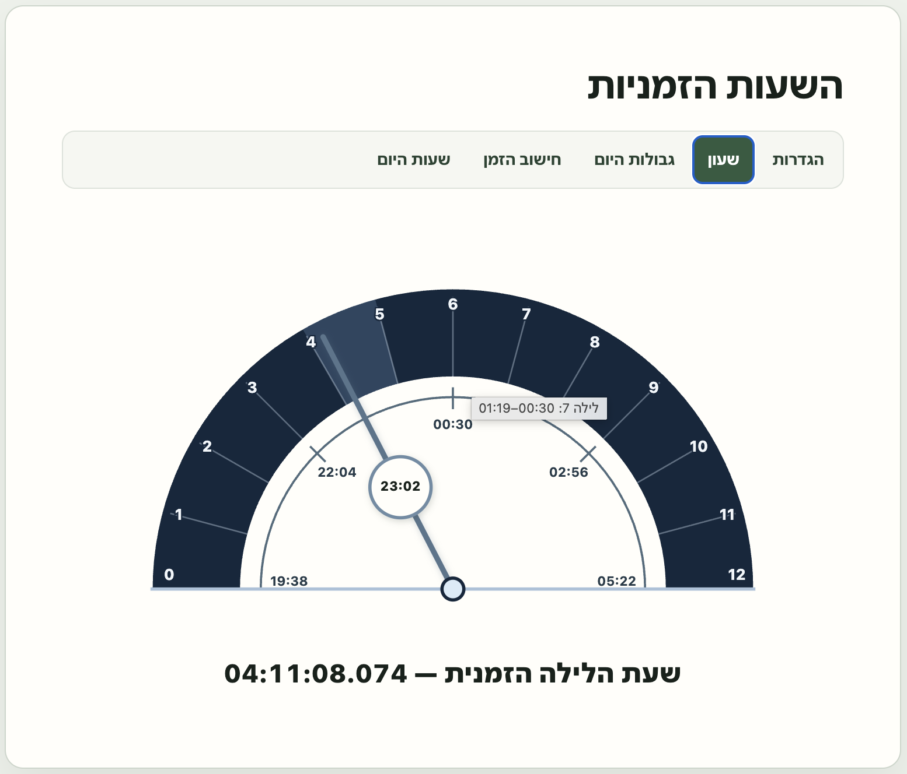

# מדריך למשתמש — השעות הזמניות

## מהו השעון?

**השעות הזמניות** הוא שעון שמחלק בנפרד את היום ואת הלילה לשנים־עשר חלקים שווים. לכן שעה זמנית אינה בהכרח באורך של 60 דקות רגילות:

- בקיץ שעות היום הזמניות ארוכות יותר ושעות הלילה קצרות יותר;
- בחורף שעות היום הזמניות קצרות יותר ושעות הלילה ארוכות יותר;
- אורך השעה משתנה לפי התאריך והמיקום.

כל החישובים האסטרונומיים נעשים במכשיר. אין צורך בחשבון משתמש או בשרת חישובים.

*תצוגת שעון הלילה: חצי העיגול מחלק את הלילה ל־12 שעות זמניות, המחוג מציג את המיקום הנוכחי בתוך הלילה, והעיגול שעל המחוג מציג את השעה המקומית הרגילה.*

תמונה של מצב היום, הכוללת גם את קשת שעות השמש מן הנץ עד השקיעה, תתווסף בנפרד.

## הגדרה ראשונה

בפתיחה הראשונה מוצגת הלשונית **הגדרות**.

1. הזינו קו רוחב וקו אורך, או לחצו על **שימוש במיקום הנוכחי**.
2. הזינו גובה מעל פני הים. אפשר גם ללחוץ על **קבלת גובה פני הים** כדי לקבל אומדן מ־Open-Meteo.
3. אפשר לבדוק את הנקודה בקישור **בדיקת המיקום במפות Google**.
4. לחצו על **הבא**. לאחר אישור המיקום תיפתח לשונית **שעון**.

הקואורדינטות וגובה פני הים נשמרים רק במשך הפעלת הדפדפן הנוכחית. התאריך של השעון החי הוא תמיד התאריך הנוכחי של המכשיר.

### גובה פני הים

הגובה מתאר את גובה המקום מעל פני הים, ולא את קומת הבניין או את גובה עיני הצופה. בגרסה הנוכחית הוא משפיע על חישוב השקיעה הנראית מול אופק אידיאלי פתוח.

האומדן של Open-Meteo מבוסס על Copernicus DEM GLO-90 ברזולוציה של כ־90 מטר. זהו אומדן של תוואי הקרקע, וניתן לערוך אותו ידנית.

## קריאת השעון

השעון מוצג כחצי עיגול המחולק ל־12 שעות זמניות.

- `0` הוא תחילת פרק הזמן הפעיל;
- `12` הוא סוף פרק הזמן;
- המספרים `3`, `6` ו־`9` מסמנים את רבעי הפרק;
- המחוג מציג את המיקום הנוכחי בתוך היום או הלילה הזמני;
- העיגול הקטן שעל המחוג מציג את השעה המקומית הרגילה;
- השורה שמתחת לשעון מציגה את הזמן הזמני הנוכחי.

ביום מופיע:

`שעת היום הזמנית — HH:MM:SS.mmm`

בלילה מופיע:

`שעת הלילה הזמנית — HH:MM:SS.mmm`

צבעי השעון מבדילים בין יום ללילה. המעבר מתבצע אוטומטית כאשר מגיעים לגבול המחושב, ללא צורך ברענון הדף.

## שתי השכבות של שעות היום

במצב יום מוצגות שתי חלוקות שונות על אותו ציר זמן.

### חצי העיגול הראשי

חצי העיגול הראשי מתאר את היום לפי השיטה שנבחרה ליישום:

- תחילת היום: **עלות השחר**, 72 דקות רגילות לפני הנץ הנראה;
- סוף היום: **צאת הכוכבים**, 72 דקות רגילות לאחר השקיעה הנראית;
- כל התקופה מחולקת ל־12 שעות זמניות שוות.

### הקשת החיצונית

הקשת החיצונית מופיעה ביום בלבד ומתארת את שעות השמש:

- תחילת הקשת מסומנת `נץ`;
- סוף הקשת מסומן `שקיה`;
- 13 סימני הגבול מחלקים את הקשת ל־12 שעות שמש שוות;
- אין מספרים על הקשת כדי לשמור על תצוגה נקייה.

הקשת מאפשרת לראות את היחס בין היום המורחב, שמתחיל לפני הנץ ומסתיים לאחר השקיעה, לבין התקופה שבה השמש נמצאת מעל האופק הנראה.

בלילה הקשת החיצונית מוסתרת.

## הלשוניות

### הגדרות

הזנה ועדכון של קו רוחב, קו אורך וגובה פני הים. מעבר ללשונית אחרת מאשר אוטומטית ערכים תקינים. הכפתור **חזרה למיקום השמור** מבטל שינויים שטרם אושרו ומחזיר את המיקום שנשמר להפעלה הנוכחית.

בתוך **תאריך בדיקה** אפשר לבחור תאריך אחר לצורכי בדיקה. תאריך זה משפיע רק על **גבולות היום** ועל תצוגת הבדיקה של **חישוב הזמן**; הוא אינו משנה את השעון החי.

### שעון

התצוגה החיה של השעה הזמנית הנוכחית, המחוג, השעה המקומית והקשת החיצונית של שעות השמש.

### גבולות היום

הלשונית מציגה את זמני הגבול שעליהם מבוסס החישוב:

1. **עלות השחר** — 72 דקות לפני הנץ;
2. **נץ החמה הנראה**;
3. **שקיעת החמה**;
4. **צאת שבת** — 36 דקות לאחר השקיעה, למידע בלבד;
5. **צאת הכוכבים** — 72 דקות לאחר השקיעה וסוף היום המחושב.

לצד כל שעה מקומית מוצג גם הזמן ב־UTC לצורכי בדיקה והשוואה.

### חישוב הזמן

הלשונית מסבירה את התוצאה הנוכחית:

- פרק הזמן הפעיל — יום או לילה;
- גבולות פרק הזמן;
- משך הפרק בדקות רגילות;
- משך שעה זמנית אחת בדקות רגילות;
- הזמן הזמני המחושב.

### שעות היום

טבלה של 12 שעות היום הזמניות. לכל שעה מוצגים זמן ההתחלה וזמן הסיום בשעה המקומית הרגילה.

הטבלה מתחלפת לתאריך הבא בצאת הכוכבים המחושבת, ולא בחצות האזרחית.

## עדכון אוטומטי

היישום בודק את הזמן פעם בשנייה. הוא מחשב מחדש את לוח הזמנים כאשר:

- התאריך המקומי של המכשיר משתנה;
- הדף חוזר מן הרקע;
- המכשיר מתעורר ממצב שינה;
- המיקום או גובה פני הים מתעדכנים.

אם השעון נשאר פתוח בזמן מעבר בין יום ללילה, התצוגה והלשוניות המחושבות אמורות להתעדכן ללא טעינה מחדש.

## פרטיות וחיבור לרשת

- החישובים האסטרונומיים נעשים מקומית בדפדפן;
- אין חשבון משתמש ואין backend;
- המיקום נשמר רק ב־`sessionStorage` של הלשונית הנוכחית;
- בקשת מיקום נשלחת לדפדפן רק לאחר לחיצה על **שימוש במיקום הנוכחי**;
- פנייה ל־Open-Meteo מתבצעת רק לאחר לחיצה על **קבלת גובה פני הים**;
- Google Maps נפתח רק לאחר לחיצה על קישור הבדיקה.

## מגבלות השיטה

הגרסה הנוכחית מיועדת למודל הישראלי שנבחר לפרויקט:

- עלות השחר מחושבת כ־72 דקות לפני הנץ;
- צאת הכוכבים מחושבת כ־72 דקות לאחר השקיעה;
- צאת שבת ב־36 דקות לאחר השקיעה מוצגת למידע בלבד;
- משך הדמדומים אינו מותאם לקווי רוחב צפוניים או דרומיים קיצוניים;
- החישוב אינו כולל בניינים, הרים סמוכים, צל מקומי, מזג אוויר או בהירות ממשית של השמים;
- השקיעה הנראית מחושבת לפי גובה פני הים ואופק אידיאלי ללא חסימות.

היישום הוא כלי חישוב והמחשה. הוא אינו תחליף לפסיקה הלכתית או ללוח מקומי מוסמך.

## פתרון בעיות

### המיקום לא מתקבל

בדקו שניתנה לדפדפן הרשאת מיקום. אפשר תמיד להזין את הקואורדינטות ידנית.

### גובה פני הים נשאר ריק

מכשירים רבים אינם מספקים גובה אמין דרך שירות המיקום. הזינו את הגובה ידנית או השתמשו בכפתור **קבלת גובה פני הים**.

### לא ניתן לקבל גובה מ־Open-Meteo

בדקו את החיבור לאינטרנט ואת תקינות הקואורדינטות. שאר החישובים אינם תלויים בשירות זה ויכולים להמשיך לאחר הזנת גובה ידנית.

### הזמנים אינם תואמים ללוח אחר

בדקו שהלוח האחר משתמש באותם קואורדינטות, באותו גובה ובאותה שיטת גבולות. לוחות שונים עשויים להשתמש בהגדרות שונות לעלות השחר, לנץ, לשקיעה ולצאת הכוכבים.
